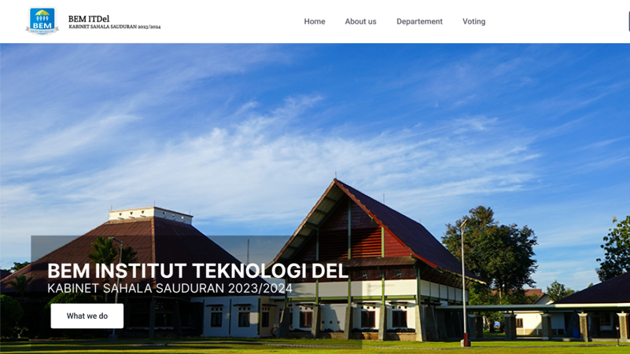

# BEM IT Del Information System

## Project Overview

The BEM IT Del Information System was developed to support organizational activities and digital information management within the Student Executive Board (BEM) of Institut Teknologi Del.

The system provides centralized access to organizational information, announcements, voting activities, and administrative services, helping improve communication and operational efficiency.

---

## Objectives

* Digitalize organizational information management.
* Improve accessibility of announcements and activities.
* Support online voting processes.
* Enhance communication between students and the organization.

---

## My Contributions

### Requirements Analysis

* Conducted requirements gathering and feature analysis.
* Assisted in defining functional requirements.
* Participated in feature planning and validation activities.

### Development

* Contributed to frontend and backend feature implementation.
* Assisted in authentication and voting module development.
* Participated in testing and debugging activities.

### Collaboration

* Worked collaboratively within a development team.
* Applied Software Development Life Cycle (SDLC) practices.

---

## Technologies Used

* Laravel
* PHP
* HTML
* CSS
* JavaScript
* MySQL
* Git

---

## Key Features

* User Authentication
* Information Management
* News and Announcements
* Online Voting System
* Organizational Activity Management

---

## Skills Demonstrated

### System Analysis

* Requirements Analysis
* Feature Specification
* Requirement Validation

### Software Development

* Web Application Development
* Frontend Development
* Backend Development
* Database Management

### Team Collaboration

* SDLC
* Git Version Control
* Team-Based Development

---

## Academic Context

This project was developed as part of coursework at Institut Teknologi Del and involved collaborative software development following SDLC principles.

---

## Project Preview

  

---

## Repository Purpose

This repository serves as a portfolio showcase demonstrating experience in system development, requirements analysis, teamwork, and software engineering practices.
